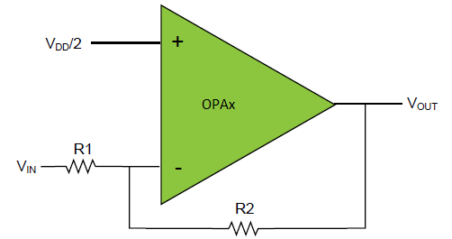

# Getting started with Mindi® simulation and PIC18-Q41 microcontrollers
This guide will get you up and running with simulating the analog OPAMP module in PIC18-Q41 family devices using the Mindi simulation tool.
## Configuration: Inverting Programmable Gain Amplifier (PGA)
The Inverting Programmable Gain Amplifier is a configuration with run-time selectable gain.

### Mindi Simulation

Download and open the follower **Mindi schematic [here](schematics/Inverting_PGA.wxsch)**

Press the _play_ button to simulate with an example stimulus source.

### Tweaking
The amplification of the Inverting PGA can be adjusted to any of 8 levels from 0.06 to 15 by changing the MUXWIP value in the control register. The Mindi schematic contains a table detailing the levels of gain and their associated register and resistor values.

### Updating composer fields
Once the desired result has been verified with Mindi simulation, the corrected values should be moved back into MCC/Start by copying resistor configurations across to the composer of your preference.

### Don't have Mindi?
Download and install [Mindi simulation tool](https://www.microchip.com/mplab/mplab-mindi)
Download and install Mindi model for AVR DB device
